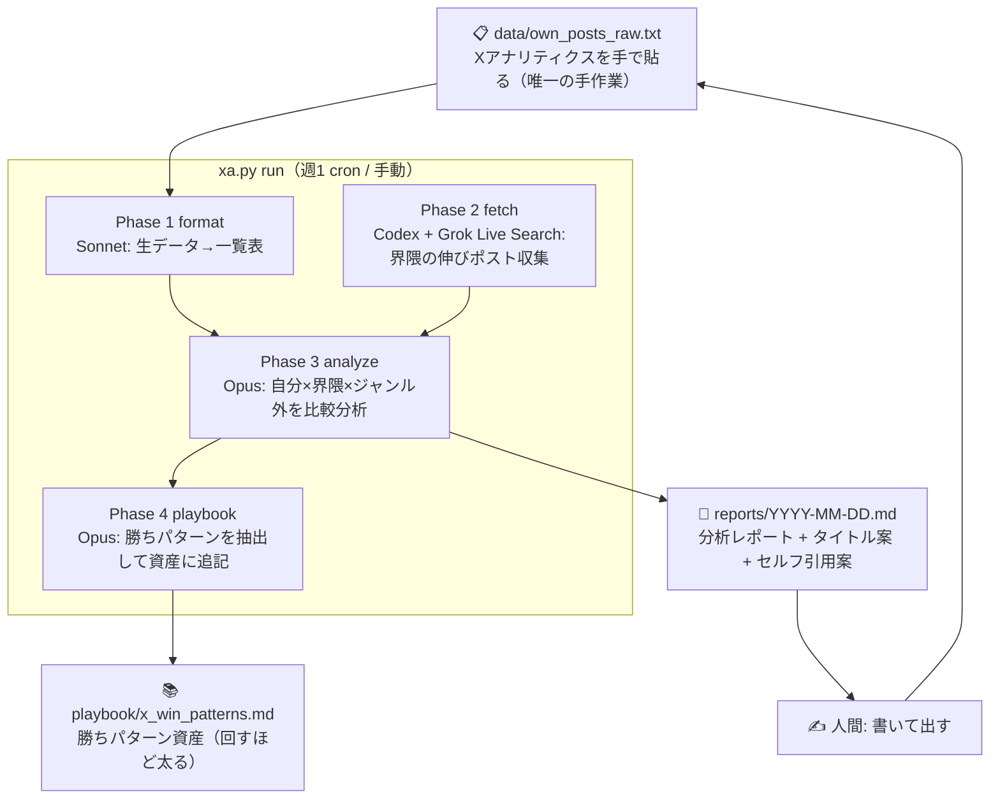

# X運用 自動分析システム（v2 再設計版）

「自分の過去ポスト分析 → 界隈の伸びポスト分析 → 勝ちパターンのmd資産化」を、
モデルの使い分けで自動で回すシステム。

- **司令塔** = Fable5（このシステムの設計・改修だけ。定常運転には使わない）
- **重い分析** = Claude Opus
- **整形・下書き** = Claude Sonnet
- **X検索（Grok）** = Codex アプリに委任（xAI Live Search を運転させる）

## アーキテクチャ



## v1 からの設計変更点

| v1 | v2（本版） |
|----|-----------|
| bash + 正規表現での YAML パース（壊れやすい） | **単一の Python CLI `xa.py`**（標準ライブラリのみ、`tomllib` で正式パース） |
| 設定が YAML（パーサ非依存の自前解析） | **`config.toml`**（コメント可・stdlib で読める） |
| Grok検索が独立スクリプト | `xa.py fetch` に統合。Codex は「実行+検証」の運転手 |
| レポートが生テキストの連結 | **構成の決まったレポート**（サマリ→自分→界隈→ジャンル外→今週のアクション） |
| PLAN.md と README が別 | 本 README に計画・使い方を一本化 |

## 使い方

```bash
# 全部まとめて（cron が呼ぶのもこれ）
python3 x-analysis/xa.py run

# 個別実行
python3 x-analysis/xa.py format     # 生データ → 一覧表 (Sonnet)
python3 x-analysis/xa.py fetch      # Grok検索 → data/niche_posts.json
python3 x-analysis/xa.py analyze    # 分析レポート生成 (Opus)
python3 x-analysis/xa.py playbook   # playbook 更新 (Opus)
python3 x-analysis/xa.py status     # データの揃い具合を確認（API不要）
```

前提: `claude` CLI（`ANTHROPIC_API_KEY`）。Grok検索には `XAI_API_KEY`、
Codex委任には `codex` CLI（`OPENAI_API_KEY`）。無いフェーズは捏造せず自動スキップ。

## セットアップ（3ステップ）

1. **Secrets**（Settings → Secrets → Actions）: `ANTHROPIC_API_KEY`（必須）／`XAI_API_KEY`・`OPENAI_API_KEY`（Grok検索用・任意）
2. **`config.toml`** のテーマ・お手本アカウントを自分の界隈に書き換える
3. **`data/own_posts_raw.txt`** に X アナリティクスの実データを週1で貼る

以降は `.github/workflows/x-analysis.yml` が毎週月曜 6:00 JST に回し、
レポートと playbook 更新を自動コミットする。旬ネタ用に手動実行（workflow_dispatch）も可。

## Grok検索を Codex に任せる仕組み

スクレイピングは規約違反・凍結リスクがあるため使わない。

1. `xa.py fetch` が xAI API（`api.x.ai`）の **Live Search（sources: x）** で公開ポストを検索
2. `codex exec --full-auto "$(cat codex/grok_search_task.md)"` で Codex に
   「fetch 実行 → 出力JSONの検証（URL実在・重複除去・捏造チェック）→ サマリ作成」を委任
3. 結果は `data/niche_posts.json`。URL未確認のポストは `"verified": false` になり分析から除外

codex CLI が無い環境では `xa.py fetch` の直接実行に自動フォールバックする。

## 捏造ガード（記事の「よくある失敗」対策）

- 自分の実数（`own_posts_raw.txt`）が無ければ自己分析はスキップ — それっぽい嘘を作らせない
- 界隈データは URL 検証必須。1件も取れなければ `posts: []` +「手で貼ってください」と正直に出す
- レポートには毎回「セルフ引用文案2本 + CTA改善案」を含める — 出して終わりを防ぐ
- 定常運転は Opus/Sonnet/Grok のみ — Fable5 の上限を溶かさない

## ロードマップ

- **v2（本版）**: Python CLI 化・TOML設定・レポート定型化
- **v3**: playbook が溜まったら Claude Code の skill 化（「いつもの型で書いて」で発動）
- **v4**: 投稿後の実数を取り込み、playbook 各パターンに勝率を記録
